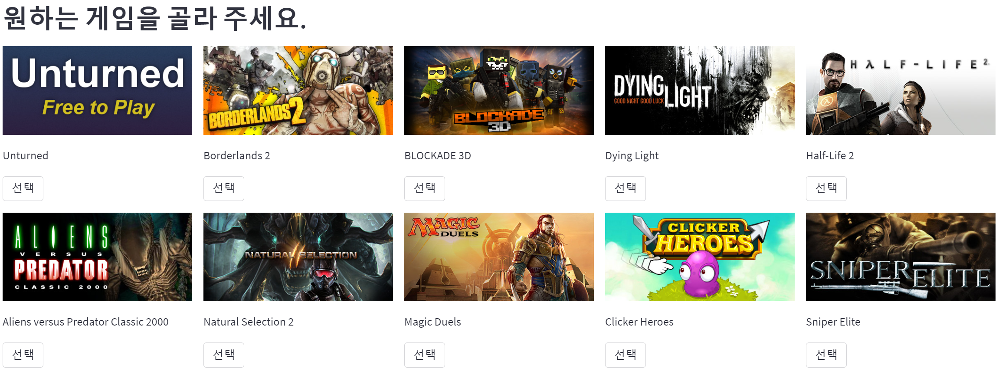

게임 추천
==============

- 추천방식
    -
    - 처음에는 토픽모델링으로 통한 각 게임에 토픽을 부여 하여 유저 데이터에서 가장 많이 접한 게임을 토픽 별 골고루 배분하여 10가지 추천

    - 한가지 게임을 선택하면 토픽 협업필터링을 통해 구한 ratings 데이터를 참고하여 해당 게임의 플레이 시간이 많은 유저 5명 중 플레이 시간 비율의 확률로 하나의 유저선택

    - 선택된 유저의 플레이 시간이 높은 순으로 게임 추천

    - 다음 선택된 게임을 기준으로 ratings 데이터를 참고하여 플레이 시간이 높은 유저 5명 중 이전의 선택한 게임과 평균 점수 중 가장 높은 유저를 선택
    
    - 선택된 유저의 플레이 시간이 높은 순으로 게임 추천
- 데이터
    -
    - https://www.kaggle.com/datasets/tamber/steam-video-games
    - https://www.kaggle.com/datasets/trolukovich/steam-games-complete-dataset
- Collaborative-Topic-Modeling
    -
    - https://github.com/RussoMarioDamiano/Collaborative-Topic-Modeling

